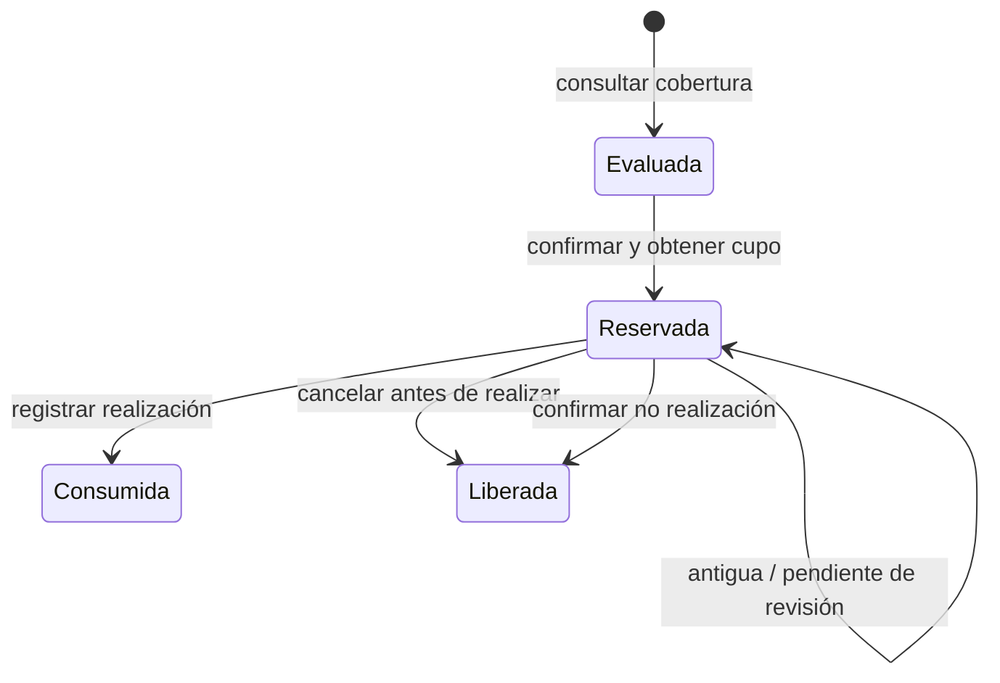
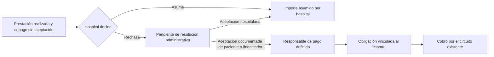
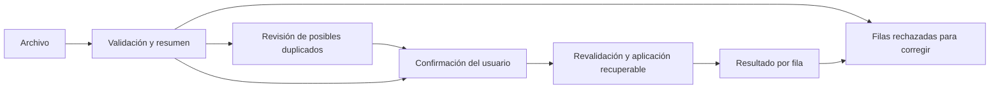

# Contratos y validación propuestos

Complementa el [plan](README.md). Este documento conserva los contratos candidatos del diseño, aprobados por la elección de Q01–Q13. La implementación concreta y sus rutas están descritas en [el estado actual](estado-implementacion.md) y en el esquema OpenAPI; los nombres candidatos de abajo no sustituyen ese contrato disponible.

## 1. Límites entre módulos

| Operación | Dueño propuesto | Entrada de dominio | Salida / efecto |
| --- | --- | --- | --- |
| Evaluar cobertura | Financiadores con consulta a aranceles de Finanzas | Caso, prestación local, cantidad y fecha; actor/ámbito verificados | Evaluación explicada y versionada, sin reserva ni obligación |
| Confirmar prestación | Servicio transaccional de cobertura | Evaluación, aceptación aplicable, clave de operación | Reserva o conflicto explícito; revisión de estado dentro del bloqueo |
| Registrar realización | Casos / hecho durable | Evento real, prestación/cantidad y referencia de confirmación | Hecho único; reserva a consumo y reparto recuperable |
| Cancelar/liberar | Operación autorizada y trazable | Reserva y motivo; no realización acreditada cuando corresponde | Libera una reserva activa sin borrar un consumo |
| Informar consumo externo | Financiadores | Afiliado propio, prestación, fecha, cantidad y referencia opcional | Uso de cobertura, sin hecho hospitalario ni obligación |
| Resolver saldo | Finanzas | Parte pendiente, resolución D25 y respaldo | Resolución registrada y obligación cuando corresponda; no dinero automático |
| Registrar cobro/reintegro | Servicios existentes de dinero | Obligación o movimiento válido | Movimiento con permisos, límites, aprobación y reintentos existentes |

La interfaz pública no acepta un importe o un identificador de otro financiador como sustituto de una evaluación del servidor. El vínculo con el caso, los planes, la prestación local y el convenio se valida conjuntamente.

## 2. API candidata

Prefijos propuestos para mantener explícita la organización y evitar inferir que un `institucion_id` es un financiador. La nomenclatura final se armoniza con el router existente antes de implementar.

| Recurso | Operación | Observaciones |
| --- | --- | --- |
| `/api/financiadores/{financiador}/planes/` | Listar / crear / editar borradores | Permiso de configuración de ese financiador |
| `.../planes/{plan}/reglas/` | Consultar / proponer publicación | Plan y regla deben pertenecer al ámbito; resolver solapamientos de vigencia |
| `.../afiliados/` | Buscar / dar alta / actualizar | Sin búsqueda global de ciudadanos ni baja por omisión |
| `.../convenios/` | Consultar y tramitar según #14 | No da autoridad al financiador para editar aranceles hospitalarios |
| `.../consumos/` | Consultar | Datos propios mínimos; origen hospitalario o externo distinguido |
| `.../consumos-externos/` | Registrar | Validación de identidad, fecha, prestación y cantidad |
| `.../importaciones/` | Subir plantilla | Devuelve identificador de lote y resumen de validación |
| `.../importaciones/{lote}/confirmar/` | Confirmar filas válidas | Revalida permisos y datos; misma clave/solicitud no reaplica |
| `.../importaciones/{lote}/` | Consultar progreso | Aplicadas, rechazadas, revisión y pendientes técnicas diferenciadas |
| `.../importaciones/{lote}/rechazadas/` | Descargar detalle | Archivo privado, errores por fila; preservar identificadores textuales |
| `/api/casos/{caso}/cobertura/evaluaciones/` | Evaluar | Autorización hospitalaria; muestra reglas e importes permitidos |
| `/api/casos/{caso}/cobertura/confirmaciones/` | Confirmar realización prevista | Reserva de D26; conflicto si la evaluación dejó de ser aplicable |
| `/api/reservas-cobertura/{reserva}/liberar/` | Liberar | Mismo hospital autorizado, motivo y comprobación de no realización |
| `/api/finanzas/resoluciones-cobertura/` | Registrar resolución | Permiso financiero explícito, respaldo y preservación del historial |

Ejemplo de evaluación, con datos ficticios:

```json
{
  "evaluacion_id": "demo-evaluacion-1",
  "revision": 1,
  "resultado": "cubierta_parcial",
  "prestacion": {"codigo": "PREST-DEMO-002", "cantidad": 1},
  "fecha_prestacion": "2026-09-15",
  "arancel": {"importe": "10000.00", "moneda": "ARS", "origen": "general_hospital"},
  "distribucion": {"financiador": "8000.00", "paciente_propuesto": "2000.00"},
  "cupo": {"periodo": "anual", "limite": 6, "consumidos": 4, "reservados": 1, "disponibles": 1},
  "aceptacion_paciente_requerida": true,
  "motivos": [],
  "reserva_creada": false
}
```

`paciente_propuesto` explica el importe antes de su aceptación; no constituye una deuda emitida. Las revisiones son datos del servidor. La confirmación envía referencias a evaluación/aceptación y una clave, sin permitir sobreescribir arancel, financiador, porcentaje o saldo.

Resultados funcionales separados: `cubierta`, `cubierta_parcial`, `no_cubierta`, `pendiente_evaluacion`, `pendiente_autorizacion`. La falta real de regla se distingue del error de evaluación. La presentación de un cupo reservado todavía se concreta en Q01/Q05: no equivale automáticamente a un consumo agotado.

Errores propuestos: petición inválida 400; falta de permiso 403 o recurso fuera del ámbito como 404 según patrón del recurso; revisión o reserva en conflicto 409. Mensajes en español y motivos estables, por ejemplo `CUPO_CAMBIO`, `AFILIACION_NO_VERIFICADA`, `REFERENCIA_REUTILIZADA`, `PERMISO_REVOCADO`. Nunca incluir datos de otro ámbito en el error.

## 3. Estados y transiciones

### Reserva confirmada por D26/D27



Una reserva no cambia automáticamente por el paso del tiempo. Si se acredita realización durante una liberación, la decisión vuelve a comprobar el estado bajo bloqueo. Para la operación perdedora se devuelve un conflicto; no se declara que ambas transiciones ocurrieron correctamente.

### Saldo administrativo D22–D25



Es una vista funcional, no un diseño ya aprobado de tablas. La creación de obligaciones y el reemplazo de la parte pendiente deben ser atómicos e idempotentes; los informes no suman dos veces el pendiente original y su resolución. La evidencia de cada transición se conserva.

### Importación propuesta



El resumen no promete que una fila ya se aplicó. Una fila que cambió desde la previsualización se informa con su resultado nuevo; si requiere una decisión humana distinta, no se fuerza la aplicación. El permiso se revalida también durante la ejecución de lotes largos.

## 4. Contratos de Excel

### Consumos externos — datos confirmados

| Columna de muestra | Contrato |
| --- | --- |
| N.º de afiliado | Obligatorio, texto; ámbito del financiador; conservar ceros |
| Documento | Obligatorio, texto; debe corresponder al afiliado indicado |
| Prestación | Obligatoria; código estable del catálogo común y ayuda personalizada del financiador |
| Fecha de prestación | Obligatoria; se utiliza para el período, no la fecha de importación |
| Cantidad | Obligatoria; positiva. La granularidad exacta debe cerrarse con Q12 |
| Referencia externa | Opcional D13; única semánticamente dentro del financiador cuando existe |

Las muestras usan una lista legible con código y nombre. El código es la identidad candidata; no se infieren equivalencias por nombre. Un nombre que cambió no debe invalidar un identificador histórico válido sin explicar el motivo. La plantilla es una ayuda, y el servidor valida catálogo, afiliación, plan y fecha.

### Padrón — formato propuesto

N.º de afiliado, documento, nombre y apellido, plan, vigente desde. Los últimos tres campos y sus reglas de obligatoriedad están propuestos para revisión Q03–Q05; #14 admite planes nulos. No hay columna de baja ni de reemplazo completo. Omitir un afiliado no altera su estado.

### Controles del importador a implementar

- Verificar formato `.xlsx`, estructura y encabezados antes de procesar filas. Rechazar macros, archivos cifrados o formatos no admitidos con explicación; no ejecutar fórmulas ni usar sus valores cacheados como entradas confiables.
- Leer la hoja de carga declarada por la versión de plantilla; omitir sólo filas completamente vacías y rechazar las parcialmente incompletas. Las instrucciones y ejemplos no se importan como datos.
- Limitar tamaño comprimido/descomprimido, número de entradas ZIP, filas, columnas y tiempo. La protección XML no reemplaza esos límites.
- Validar textos, fechas y cantidades del servidor. No seguir enlaces externos del libro ni confiar en una hoja oculta que diga a qué financiador pertenece.
- Propuesta de control de uso accidental: identificar la emisión y versión de plantilla en el servidor y comprobar que corresponden al financiador activo antes de aplicar filas. Un archivo de A abierto desde B se rechaza como plantilla equivocada; sus metadatos no otorgan permisos ni sustituyen las validaciones del contenido.
- Guardar las filas normalizadas para la revisión; confirmar exactamente ese lote. Una nueva subida es otro lote, incluso si parte de sus filas coincide.
- Reenviar el mismo lote no repite efectos. Referencia externa igual con otros datos produce conflicto. Una coincidencia sin referencia se revisa y no se declara duplicado inequívoco.
- Agrupar búsquedas por identificadores para evitar una consulta por celda; revalidar estado mutable en la transacción de aplicación.
- Aplicar las filas válidas conforme a D10, conservando rechazo/revisión/error técnico por separado. Corregir una fila rechazada no obliga a reaplicar las ya importadas.
- Descargar errores como celdas de texto literal y valores seguros; no convertir contenido del usuario en fórmulas de Excel/CSV.
- Preservar las fechas originales en correcciones. Un consumo externo corregido no borra decisiones de cobertura hospitalarias ni una alerta ya registrada.
- Archivos y errores se almacenan/descargan bajo permisos del financiador; Q13 define retención. Los logs no contienen documentos, nombres, importes ni el archivo original.

## 5. Matriz de aceptación para la implementación

Esta matriz especifica pruebas por escribir en los lotes; **no son pruebas ya ejecutadas**. DB significa PostgreSQL con transacciones reales; E2E significa navegador con API real en entorno aislado, salvo que se indique simulación.

| Acuerdo | Evidencia esperada |
| --- | --- |
| D1/D2 | General $10.000 sin excepción; excepción vigente $8.000; sólo hospital autorizado modifica valores; sin precio no inventar un importe |
| D3 | 80 % con/sin tope; límites de porcentaje; importes decimales y suma conservada |
| D4 | Cuatro usos en A dejan dos en B para el mismo afiliado; no mezclar financiadores ni personas |
| D5 | Sexto uso cubierto, siguiente sin cobertura por cupo agotado; sin solicitud excepcional automática |
| D6/D7 | Aceptación por prestación e importe; otro importe/prestación no la reutiliza; copago parcial calculado exactamente |
| D8 | Consumo externo reduce cupo sin hecho hospitalario, cargo ni dinero |
| D9/D10 | Varias personas/prestaciones, resumen antes de aplicación, válidas aplicadas y rechazadas descargables |
| D11 | Dos plantillas con catálogos diferentes; archivo modificado no evade alcance; catálogo válido no prueba cobertura de cualquier plan/fecha |
| D12 | Identificadores textuales, ceros iniciales, falta/mismatch rechazados, número familiar según Q03 |
| D13 | Reintento del mismo lote; referencia repetida igual/distinta; posible duplicado sin referencia; doble confirmación concurrente |
| D14 | Carga tardía conserva decisión/cargo/aceptación y señala discrepancia; afecta próximas evaluaciones del período correcto |
| D15 | Fin de mes/año, año bisiesto, importación de diciembre en enero, fecha de registro separada |
| D16 | Mapeo de dos códigos hospitalarios a una referencia común; no equivalencia por nombres; referencia inválida/inactiva explicada |
| D17/D18 | Afiliado sin atención previa; altas/actualizaciones masivas; omisión no da baja; filas erróneas no cambian vigencias |
| D19 | Cambiar de plan conserva usos del mismo financiador; cuatro de diez dejan seis |
| D20 | A→B sin traslado de consumos; regreso a A conserva usos; nuevo número no reinicia identidad; B no consulta datos de A |
| D21 | Caso mantiene afiliación inicial vencida; corrección registrada sólo para evaluaciones posteriores; padrón no sustituye caso |
| D22/D23 | Rechazo hospitalario deja saldo visible y sin deuda automática al paciente/financiador; no cancela atención |
| D24 | Falta/revocación de permiso, otro hospital/área y decisión sin motivo rechazados; usuario/fecha registrados |
| D25 | Las dos resoluciones documentadas, ausencia de aceptación sigue pendiente, doble resolución no crea dos cargos, cobro separado |
| D26 | Consulta no reserva; dos conexiones compiten por último uso; realización consume una sola vez; cancelación libera una sola vez |
| D27 | Tiempo no libera; revisión sólo libera tras confirmar no realización; carrera con realización preserva resultado válido |
| Seguridad transversal | Usuario mixto, cambio de organización, exportaciones, archivos, búsquedas, URLs directas, permisos revocados y auditoría |
| Recuperación | Fallo al distribuir después del hecho; reintento conserva arancel/afiliación original; circuito legado no duplica obligaciones |
| Reportes | Total de partes, pendiente administrativo, deuda y dinero separados; resolución no duplica suma; hospital asumido no duplica costo |

### Escenarios de fallo que debe cubrir el diseño

1. API cae después de confirmar reserva pero antes de responder: repetir la clave devuelve la reserva existente.
2. Dos operadores confirman el lote: una fila genera un único consumo; una respuesta repetida no cuenta como nuevo éxito.
3. Consumo externo llega entre resumen y confirmación: revalidación controla cambio y no promete un cupo inexistente.
4. Realización compite con liberación de reserva antigua: bloquear/releer y rechazar la transición incompatible.
5. Dos procesos resuelven el mismo saldo: conservar una resolución válida y evitar dos obligaciones.
6. Se revoca la membresía durante una importación: no seguir aplicando filas con un permiso inexistente; conservar lo ya confirmado y explicar el resto.
7. Regla/arancel/afiliación cambia mientras el paciente acepta: detectar revisión distinta; aplicar Q01/Q05 sin ampliar su aceptación.
8. Se desactiva el nuevo circuito después de crear un hecho: su recuperación no ejecuta el circuito legado además del nuevo.

## 6. Comandos previstos y alcance de evidencia

Comandos del repositorio, para ejecutar durante implementación con una base PostgreSQL de prueba configurada y autorizada. No usan la base real como dato de entrada de una prueba.

```powershell
# Desde backend, regresión focal de integración financiera existente:
python manage.py test apps.finanzas.test_cobros apps.finanzas.test_dinero apps.finanzas.test_permisos_contables --noinput

# Validación del proyecto y consistencia de migraciones, después de implementar:
python manage.py check
python manage.py makemigrations --check --dry-run

# Desde frontend, después de agregar los recorridos:
npx playwright test --config playwright.finanzas-ui.config.js
```

Los módulos nuevos de prueba se nombrarán junto a cada implementación; no se presenta como ejecutable hoy un `test_financiadores` inexistente. La suite de concurrencia requiere `TransactionTestCase`/conexiones independientes y PostgreSQL; una simulación en memoria o SQLite no la reemplaza.

Después del pase focal, la documentación post-demo del repositorio identifica esta regresión amplia cuando sea necesaria y esté autorizada:

```powershell
# backend
python manage.py test apps.finanzas apps.accounts apps.casos apps.auditoria --noinput --verbosity 1

# frontend
npm run build
```

La nueva suite de Financiadores se añadirá a esa regresión. No se reutilizan los 739 resultados históricos como prueba de este módulo.

## 7. Operación y salida de incidentes

- Medir: reservas activas/antiguas por período, lotes en curso y sin progreso, filas aplicadas/rechazadas/revisión, capturas incompletas y saldos administrativos pendientes.
- Mostrar: fecha del último intento, motivo operativo seguro y siguiente acción permitida. No esconder un error de procesamiento como ausencia de consumo.
- Recuperar: desde hecho/lote/reserva persistidos, con la misma identidad de operación y relectura de permisos/estado. D27 no permite que el recuperador venza reservas clínicas por tiempo.
- Separar: un plazo para que un worker retome un trabajo interrumpido no es el vencimiento de un cupo reservado ni de una autorización del financiador.
- Antes del piloto: migración aditiva probada sobre copia, reporte de legado sin inferencias silenciosas, usuarios/ámbitos revisados y restauración ensayada.
- Reversión: limitar nuevas operaciones mientras se mantienen lecturas y recuperación; conservar históricos, reservas y obligaciones. Reabrir sólo después de reconciliar los efectos confirmados.
