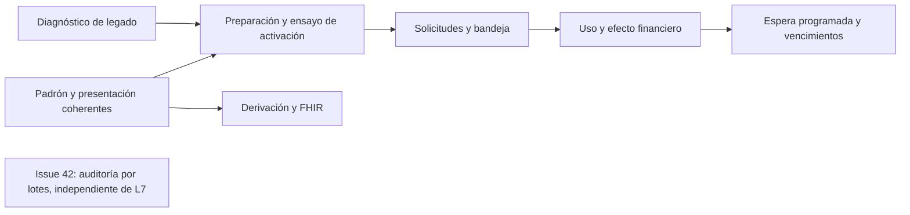

# Continuidad del circuito de financiadores y cobros

Fecha: 16/09/2026. Código analizado: `0c0d559`, rama `codex/financiadores-cobertura`,
[PR #41](https://github.com/Mkdir-arg/SistemaDeSalud/pull/41), todavía en borrador.

Este documento responde al pedido de analizar lo disponible y planificar el resto
del circuito. Es una propuesta de continuidad, no evidencia de funcionalidades
implementadas. Conserva D1–D27 y Q01–Q13; las recomendaciones nuevas se identifican
como tales. No autoriza ejecutar cargas sobre datos reales ni activar esperas clínicas.

## 1. Conclusión

El recorrido principal **parametría → padrón → cobertura → reserva → realización →
cargo → cobro → reporte** está implementado y probado. El piloto automatizado pasó,
pero eso no cierra todas las condiciones de los issues #13–#20.

Quedan tres frentes funcionales: integrar la identidad administrativa con el padrón
y los datos anteriores; completar autorizaciones previas; y cerrar los contratos
de derivación/FHIR previstos en #14. La preparación y aceptación del entorno real
son un frente operativo independiente. Liquidación, facturación fiscal y conciliación
bancaria permanecen fuera del alcance de #15/#19/#20.

Recomiendo completar primero la convivencia del padrón y el legado, preparar la
activación y luego incorporar autorizaciones en incrementos. Una alternativa válida
es priorizar autorizaciones en un hospital nuevo sin datos históricos: entrega antes
esa funcionalidad, pero posterga la coherencia del padrón y exige mantener acotado el
piloto. Para la continuidad general de Cauce, la primera secuencia cubre mejor lo que
el hospital ya ve y usa.

## 2. Estado contrastado con código e issues

| Parte del circuito | Estado observado | Evidencia / trabajo restante |
| --- | --- | --- |
| Organización, planes, convenios y usuarios | Implementado | `financiadores/models.py`, `views.py`, portal; membresía propia, activación de cuentas y separación de ámbitos. |
| Reglas, precio, cupo y consumos externos | Implementado | `cobertura.py`, `services.py`, `importaciones.py`; arancel general/excepción, meses/años calendario, cupo entre hospitales, XLSX personalizado, reintentos y discrepancias. |
| Cobertura del caso e historial | Implementado | `clinica.py`, `api_clinica.py`; selección explícita, aceptación por prestación/importe, historia de elecciones por caso. |
| Realización, cargos y dinero | Implementado | `casos/motor.py::avanzar`, `financiadores/cobros.py`, `finanzas/dinero.py`; copago pendiente si no hay aceptación, resolución designada, cobros parciales, reducciones y reintegros. |
| Actividad y seguimiento | Implementado | `actividad.py`, `seguimiento.py`, CSV auditados. Importe original del financiador separado del saldo hospitalario. |
| Padrón administrativo frente a nueva cobertura | **Incompleto** | `PadronDetalle.jsx` aún muestra `obra_social` como «Cobertura» y permite editarlo; `Registros.jsx`, `Shell.jsx` y `ui/paciente.jsx` también muestran el texto. `CiudadanoSerializer` mantiene ese campo editable. |
| Consulta administrativa sin caso | **Por completar** | La nueva consulta de ciudadano ofrece historial de selecciones por caso y exige `casos_operar`; no es todavía un resumen administrativo del padrón actual del financiador, previo a la primera atención. |
| Legado | **Pendiente** | No existe el comando de diagnóstico/migración previsto por #13/#14 y el plan. El servicio actual exige número, documento y vigencia; no puede convertir un nombre libre en afiliación verificada sin esos datos. |
| Autorizaciones previas y bandeja | **Pendiente, L7** | No hay modelo/ciclo de autorización, modalidad de regla ni bandeja. `auditor` es hoy de lectura; no equivale a un auditor habilitado para resolver solicitudes. |
| Derivación entre hospitales | **Integración pendiente** | `red/motor.py::_paciente_en` copia `obra_social` como texto al crear el ciudadano destino. No transporta una selección estructurada ni acredita convenio en destino. |
| FHIR Coverage | **Pendiente de #14** | `fhir/recursos.py` emite una extensión textual; `fhir/tests.py` comprueba expresamente que no se presenta como `Coverage`. |
| Operación real | **Pendiente** | Migraciones verificadas en bases aisladas; resta ensayo sobre copia autorizada del destino, restauración, configuración, permisos y aceptación del piloto. |
| Rendimiento de auditoría masiva | **Issue #42 creado** | 5.000 personas: 6,727 s y 5.008 sentencias locales. Optimización acotada, sin cambiar evidencia individual ni permisos. |

La lista de GitHub consultada mantiene abiertas #13–#20. Sus secciones «estado actual
del código» son históricas: no son una descripción del código de este PR. También se
consultaron #38/#39 para conservar el circuito de dinero y evitar convertir el plan
en una reimplementación del módulo financiero completo.

### Diferencias ya resueltas que no deben reabrirse como defectos

- La afiliación la informa el padrón del financiador; el hospital selecciona/verifica
  para el caso. No se importan como verdades los nombres libres del legado.
- Varias afiliaciones no implican combinar pagadores ni elegir otro automáticamente.
- Sin aceptación, el saldo no pasa por defecto al hospital ni se vuelve deuda del
  paciente. Se conserva el pendiente y se resuelve según D24/D25.
- El cupo cuenta consumos y reservas de la persona dentro del financiador, compartido
  entre hospitales; no se reinicia al cambiar plan y no depende del cobro de la cuenta.
- La invitación actual genera un enlace para compartir por el canal habitual; no
  está autorizado agregar envío de correo/WhatsApp por tomar literalmente #14.
- Liquidación formal, factura, conciliación y pagos desde el portal del financiador
  no son requisitos pendientes de esta primera entrega.

## 3. Bloques propuestos y orden de ejecución

### B1 — Diagnóstico del legado, sin mutaciones

**Objetivo observable:** conocer qué textos históricos pueden reconciliarse con el
padrón verificado y cuáles requieren intervención, antes de decidir una conversión.

- Comando de gestión con institución obligatoria, procesamiento por lotes y orden
  estable. Reutilizar `normalizar_documento` y las identidades existentes.
- Clasificar: sin dato, candidato único, ambiguo, sin documento, sin padrón verificado,
  plan desconocido, identidad en conflicto o sin convenio. Separar coincidencia
  documental, alias revisado de organización y simple semejanza de texto.
- Resumen agregado por defecto; reporte detallado en una ruta privada elegida fuera
  del repositorio. No imprimir documentos ni nombres en logs de ejecución/CI.
- Registrar fecha del diagnóstico, hospital, identificadores y criterios utilizados;
  un candidato no concede acceso ni crea afiliados, casos, selecciones o cargos.
- Nada de crear números ficticios, organizaciones a partir de cada variante textual,
  fusionar personas ni completar planes/fechas por inferencia.

**Archivos:** nuevo comando en `apps/financiadores/management/commands`, pruebas focales,
guía operativa; lectura de `registros.Ciudadano`, `Afiliado`, `Plan` y `Convenio`.
No necesita una tabla nueva ni una migración.

**Aceptación:** datos iguales antes/después; ceros iniciales preservados; homónimos,
NN, varias afiliaciones, convenio cerrado y documento corregido tienen resultados
explicables; repetición sobre la misma fuente conserva las clasificaciones.

**Dependencias:** ninguna respuesta adicional para implementarlo en datos ficticios.
Es el próximo bloque recomendado.

### B2 — Una presentación coherente de cobertura en el hospital

**Objetivo observable:** antes de la primera consulta, Admisión distingue el dato
declarado, las afiliaciones vigentes y la elección histórica de cada caso.

- Reutilizar la consulta al padrón por documento del ciudadano del hospital y convenios
  autorizados. No permitir consultar un documento arbitrario desde un ID de otro ámbito.
- Resumen administrativo con estado, financiador, plan, número y vigencia; conservar
  el historial por caso como información separada. No llamar «actual» a la última
  selección de un caso antiguo.
- Integrar ficha administrativa, alta/edición, listado y encabezados compartidos.
  El texto existente se identifica como dato declarado/legado, nunca como verificación.
- Para hospitales habilitados, retirar su edición como fuente de cobertura; cualquier
  declaración nueva usa el contrato explícito del circuito, con actor y motivo.
  Mantener compatibilidad del hospital que aún no activó cobertura, sin vaciar su dato.
- Evaluar permisos de lectura administrativa con `padron_admision`, ámbito hospitalario
  y mínimos datos. Seleccionar la afiliación del caso mantiene sus permisos actuales;
  no conceder acceso clínico ni financiero para resolver una necesidad de mostrador.
- Cuando hay varias afiliaciones, mostrarlas y conservar elección expresa por caso.
  Verificar padrón no concede una aceptación general del paciente para cargos futuros.

**Archivos:** `registros/views.py`, `serializers.py`, consulta administrativa en
`financiadores`, `PadronDetalle.jsx`, `Registros.jsx`, componentes compartidos de
paciente y las rutas existentes de cobertura. Reutilizar componentes de Cauce.

**Aceptación:** un cambio de obra social se ve para nuevos ingresos sin alterar el
caso anterior; ninguna pantalla llama «verificada» a un texto; sin historia clínica
se puede consultar sólo el resumen permitido; hospital/usuario/área ajenos no filtran
datos; un hospital no habilitado conserva su operatoria.

### B3 — Conversión revisada y preparación operativa del piloto

**Objetivo observable:** habilitar un hospital con configuración comprobada y una
salida operativa que conserve las prestaciones y el dinero ya comprometidos.

- Usar B1 para preparar un mapeo revisable. El padrón confirmado del financiador se
  carga con el importador existente; el texto legado por sí solo no crea una afiliación.
- Un eventual aplicador de vínculos debe ser explícito, idempotente, auditable y
  revalidar el estado al aplicar. No seleccionar cobertura retrospectivamente en
  casos ni generar cargos históricos. Si las herramientas actuales resuelven la
  carga, no agregar otro importador.
- Comprobar catálogo/equivalencias, convenios, reglas, aranceles, padrón y concesiones
  de usuarios designados. Mostrar faltantes sin habilitar ni corregir en silencio.
- Ensayar migraciones desde una copia de la versión/base objetivo y probar restauración;
  verificar que obligaciones y movimientos previos conservan sus identidades/importes.
- Ensayar suspensión de nuevas operaciones, lectura histórica y recuperación de
  capturas ya registradas, incluyendo reservas abiertas. No usar migración inversa
  destructiva como procedimiento de reversión.
- Acordar retención y destino de reportes/importaciones, responsables de pendientes
  y de reservas antiguas. No programar purgas con un plazo inventado.

**Aceptación:** recorrido con roles reales de prueba, dos hospitales y dos financiadores;
la configuración incompleta queda identificada; recuperar dos veces no duplica deuda;
detener nuevas operaciones no elimina compromisos ni transforma el circuito del origen.

**Límite:** se puede preparar y ensayar todo en aislamiento. La base destino, la copia
autorizada, usuarios y datos reales deben ser identificados antes de aplicar allí.

### B4 — Autorizaciones previas: contrato administrativo y portal (L7a)

**Objetivo observable:** el hospital solicita una autorización y el financiador puede
observarla, aprobarla o rechazarla, con historia, sin marcar una prestación como realizada.

- Modelo independiente de autorización; las reservas de cobertura siguen representando
  compromisos de cupo y no se convierten en solicitudes. Una autorización puede amparar
  varias realizaciones; requiere trazabilidad de cada uso, no sólo un contador editable.
- Extender la regla con exigencia de autorización y agregar plazo de respuesta por
  convenio. Defaults compatibles con las reglas existentes, habilitación explícita.
- Estados: pendiente, observada, aprobada, rechazada, vencida y anulada. Separar plazo
  de respuesta, vigencia de la aprobación y cantidad autorizada/restante.
- APIs de hospital y financiador, justificación mínima destinada al financiador,
  reenvío tras observación, número externo, evidencia de resolución y claves de reintento.
  Identificar el intento/paso que origina la solicitud: un flujo puede volver al mismo
  nodo, por lo que caso + nodo no bastan para reconocer una repetición.
- Capacidad específica para resolver autorizaciones dentro de la organización. El
  rol `auditor` actual conserva su lectura: no promover automáticamente a esos usuarios.
- Pantalla del caso y bandeja en el sidebar existente del portal: filtros por hospital,
  estado, urgencia y antigüedad; decisiones con motivo y actualización del caso.
- Cierre de convenio o baja posterior conservan sólo acceso al expediente pendiente
  propio. Una resolución tardía no reactiva afiliación ni habilita prestaciones nuevas.

**Archivos:** modelos/migración aditiva, servicios y API en `financiadores`, reglas,
permisos/membresías y portal; notificaciones/auditoría existentes.

**Aceptación:** reintentos y respuestas concurrentes no duplican decisión; un auditor
de lectura no resuelve; otro financiador no accede; la justificación no expone la historia;
aprobar no crea `HechoAtencionCosteable`, no mueve dinero ni completa un nodo de atención.
La modalidad nueva se prueba en aislamiento y no se habilita para uso real antes de
completar B5 y las guardas de B6 que requiera el circuito.

### B5 — Uso de autorización y efecto financiero (L7b)

**Objetivo observable:** el sistema distingue cobertura del plan, autorización y
responsabilidad de pago, manteniendo los compromisos y la atención ya registrada.

- Reutilizar `evaluar`, `ReservaCobertura`, el hecho durable y `DistribucionCobro`.
  Una aprobación no incrementa el cupo del plan ni duplica consumos.
- Recomendación: autorización acotada al convenio/hospital y prestación común, con
  vigencia y cantidad; el cupo del plan permanece compartido entre hospitales. No
  presumir que una aprobación pedida por un hospital habilita a todos los demás.
- Distinguir cantidad autorizada disponible, comprometida y efectivamente usada.
  La reserva compromete; la realización consume; la liberación exige confirmar no
  realización. Aprobación administrativa sola no gasta el cupo.
- Definir un orden único de bloqueos para caso, afiliado, autorización, reserva y
  hecho en los caminos afectados, compatible con el orden actual; probarlos con
  conexiones concurrentes en PostgreSQL, no sólo con pruebas unitarias.
- Recomendación para una prestación realizada sin aprobación: importe financieramente
  pendiente de autorización, separado de deuda exigible. Al aprobar, completar mediante
  el circuito existente de cargos de forma idempotente. Un rechazo no borra cargos
  emitidos ni los traslada automáticamente al paciente: conserva evidencia y requiere
  resolución designada o ajuste explícito.
- Diferenciar aprobación tardía de aprobación posterior al vencimiento/cancelación;
  no revivir una solicitud terminal ni tocar importes anteriores sin una operación
  documentada. Si el arancel cambia y afecta al paciente, solicitar aceptación nueva.
  Verificar vigencia al comprometer y al realizar, preservando ambos registros si las
  condiciones cambiaron. Una autorización vencida no desaparece del historial ni se
  considera válida por haber sido seleccionada antes.
- Agregar estados a actividad, pendientes y exportaciones sin sumar dos veces el
  pendiente administrativo, la cuenta emitida y su cobro.

**Aceptación:** último uso disputado, realizar/liberar simultáneamente, aprobar después
de realizar, rechazo tardío, arancel modificado, afiliación/convenio cerrados y repetición
de captura. Originales y pagos se conservan; ningún estado desconocido se vuelve cero.

### B6 — Espera de lo programado, vencimientos y supervisión (L7c)

**Objetivo observable:** sólo una atención programada configurada expresamente espera
la autorización; Guardia y casos urgentes mantienen continuidad clínica.

- `avanzar()` completa el nodo actual y puede registrar atención. **Aprobar debe levantar
  la espera y devolver el caso al mismo paso pendiente**, no llamar a `avanzar()` para
  fabricar una realización. La acción clínica posterior registra lo que se hizo.
- Recomendación: clasificación explícita y versionada del circuito como Guardia,
  programado o no definido. No derivarla del nombre del área ni sólo de encontrar
  triage. Hoy `Flujo.ambito` expresa institución/área/subárea, no esa clasificación.
- La espera requiere circuito programado, opción del nodo `esperar_autorizacion` y
  prioridad distinta de URGENTE. Guardia y circuito no definido no esperan por defecto.
  La clasificación y las guardas se verifican al publicar y en ejecución.
- Motivo/referencia de espera separado de `Caso.esperando` (subproceso) y de
  `reactivar_en` (tiempo). Conservar compatibilidad con fila, cama, estudio y traslados.
- Supervisión puede continuar con motivo dentro de su hospital/área; no equivale a
  aceptar un copago ni a conceder la aprobación del financiador. No reutilizar el
  permiso financiero de resolver saldos para esta decisión clínica.
- Reutilizar `correr_tiempos`: vencimiento administrativo con selección indexada,
  lotes, bloqueo, revalidación e idempotencia. Vencer deja decisión pendiente y avisa;
  no hace avanzar ni cancela una práctica automáticamente. SLA ausente no vence solo.
- Reutilizar notificaciones internas, con claves/deduplicación y destinatarios del
  hospital. Un fallo de entrega no deshace una decisión persistida ni cancela atención.
- Si la prioridad pasa a URGENTE durante una espera, mostrar salida inmediata para
  personal autorizado con motivo; no completar la prestación ni mover el caso por
  el simple cambio de un campo. Registrar la decisión en la traza sin importes.

**Alternativa examinada con Claude:** un nodo específico de espera de autorización
aislaría esa espera, pero añade un tipo al editor/motor y obliga a representar otra
etapa del flujo. Recomiendo primero la opción explícita del nodo existente con motivo
de espera separado, alineada con #18. La elección se registra aquí como recomendación
de diseño, no como arquitectura ya implementada o decisión humana demostrada.

**Aceptación:** guardia no urgente y caso URGENTE no esperan; programado sí cuando se
configura; aprobación y vencimiento simultáneos dejan un único resultado; aprobación
vieja no libera otra espera; cancelar el caso anula pendientes y libera únicamente lo
que se confirmó no realizado; supervisor sin permiso/motivo no continúa. Un vencimiento
de autorización no interfiere con temporizadores clínicos ni duplica notificaciones.

### B7 — Derivación e interoperabilidad de cobertura

**Objetivo observable:** al trasladar a una persona, el hospital destino reconoce la
información administrativa disponible sin heredar permisos, precio ni compromisos ajenos.

- Reutilizar el padrón estable del financiador y ciudadanos por institución. Compartir
  referencia administrativa mínima; volver a comprobar identidad, convenio y vigencia
  en destino, con selección expresa del nuevo caso. No copiar automáticamente la
  aceptación de pago, la reserva ni una autorización de otro convenio.
- Mantener el dato declarado original y tratar NN/documentos conflictivos sin fusionar.
- FHIR `Coverage`: definir perfil y alcance de acceso antes de implementar, basados
  en afiliación estructurada verificable; conservar compatibilidad de la extensión
  textual y contratos actuales. No exportar todas las afiliaciones del financiador
  ni exponer la selección de otro hospital por coincidencia de documento.

**Archivos:** `red/motor.py`, servicios administrativos de `financiadores`, fachada
FHIR y sus pruebas. B2 es su dependencia; puede adelantarse si el piloto incluye Red
o un consumidor FHIR. Si no, sigue después del circuito administrativo de L7.

**Aceptación:** convenio ausente en destino, cambio de financiador, múltiples afiliaciones,
NN, dato sólo declarado y reintento de traslado; nunca exportar texto libre como
afiliación verificada ni duplicar reservas/deudas del caso origen en el nuevo caso.
El consumo del cupo común de esa persona sigue siendo el mismo entre hospitales.

### B8 — Rendimiento de auditoría, independiente

[Issue #42](https://github.com/Mkdir-arg/SistemaDeSalud/issues/42), incorporado al
proyecto 1, `Proyecto: Salud`, `Tipo: Task`, `Status: Backlog`.

Agrupar escrituras conservando la evidencia individual y la transacción completa.
El issue contiene medición base, comando reproducible, archivos y criterios de fallo
en cualquier lote. Puede avanzar en paralelo a B3/B4 si la latencia del piloto lo
justifica; no requiere esperar a L7 ni introducir infraestructura adicional.

## 4. Decisiones críticas para desarrollar L7

Son recomendaciones del agente para concretar el plan bajo la instrucción de continuar
con recomendaciones. No se presentan como respuestas nuevas aportadas por el usuario.

| Tema | Recomendación | Consecuencia / condición para revisarla |
| --- | --- | --- |
| Guardia frente a URGENTE | No esperar en Guardia ni en URGENTE; sólo programado explícito puede esperar. | Requiere clasificación verificable del circuito; hoy no existe. No habilitar esperas basándose en títulos de áreas. |
| Aprobación y realización | Aprobar habilita el paso; el hospital registra la realización después. | Precisa interpretar «el caso avanza» de #17/#18 como liberación de la espera, no atención ficticia. |
| Auditor del financiador | Resolución con capacidad expresa; auditor actual sigue de lectura. | Cambio acotado de permisos, sin concesiones masivas por migración. |
| Alcance de autorización | Convenio/hospital + afiliado + prestación, vigencia y cantidad. | Si se requieren autorizaciones portables entre hospitales, ampliar contrato antes de implementarlas. Cupo del plan sigue compartido. |
| Plan y autorización | Aprobar no aumenta un tope agotado ni reescribe la regla del plan. | Una excepción de cobertura/cupo exige contrato propio; no esconderla dentro de «aprobar». |
| Prestación urgente realizada | Mantener hecho y pendiente administrativo; resolver responsabilidad sin borrar historia. | No convertir rechazo en deuda automática del paciente. El comportamiento de cargo «rechazado» de #18 debe reconciliarse con D24/D25 antes del código. |
| Baja/convenio cerrado | Acceso mínimo al expediente pendiente propio; no nuevas prestaciones. | Aprobación tardía no restaura membresía/afiliación ni aceptación anterior. |
| Plazo de respuesta | Fijar al solicitar; observar no reinicia indefinidamente el vencimiento. | Si el financiador necesita pausar o ampliar el plazo, hacerlo explícito y auditado. |
| Vencida/rechazada/anulada | Estados terminales; reintento administrativo mediante nueva solicitud vinculada. | No perder el antecedente; una respuesta tardía requiere revisión, no resurrección silenciosa. |

## 5. Dependencias, validación y entrega

Cada bloque deberá tener criterios positivos, negativos y de reintento comprobados
por API, y recorrido de navegador cuando cambie una pantalla. PostgreSQL para carreras
de cupo, aprobación, captura y espera; SQLite no certifica `select_for_update`.
El ensayo de volumen queda optativo. Las métricas con datos ficticios no reemplazan
el ensayo del entorno objetivo.

- B1/B2: pruebas de diagnóstico, permisos del padrón, selección/historia y compatibilidad
  de hospitales habilitados/no habilitados; no ejecutar backfill real.
- B3: migraciones y restauración en copia autorizada, fuentes históricas invariantes,
  recuperación/reintentos y apertura de archivos en la herramienta del piloto.
- B4–B6: matriz de transiciones y concurrencia, errores de auditoría/notificaciones,
  aislamiento y reglas de espera, pruebas del motor/temporizadores/editor afectadas.
- B7: contratos de Red/FHIR y pruebas de privacidad; verificar la especificación/perfil
  externo vigente cuando se implemente, sin inventar una interoperabilidad validada.
- B8: prueba comparativa de 100/1.000/5.000 personas y rollback de todos los lotes.

Continuar con commits separados por incremento y el PR #41 según lo solicitado,
actualizando su descripción y evidencia. No mezclar otros módulos de Finanzas ni
cerrar las épicas por haber terminado una pantalla. Antes de habilitar L7 deben estar
completos sus contratos, UI, recuperación, permisos y guardas; no presentar una regla
que requiere autorización como cubierta mientras esa modalidad no esté implementada.

**Revisión del plan:** lectura de código, docs e issues, con análisis de riesgos de
Claude y contraste del agente principal. Claude también revisó el documento final
contra los puntos de integración y no encontró hallazgos materiales. No se ejecutaron tests ni modificaciones de
producto en esta planificación. La evidencia de ejecución anterior está en
[piloto integral](piloto-integral.md); no se atribuye a las funcionalidades propuestas.
